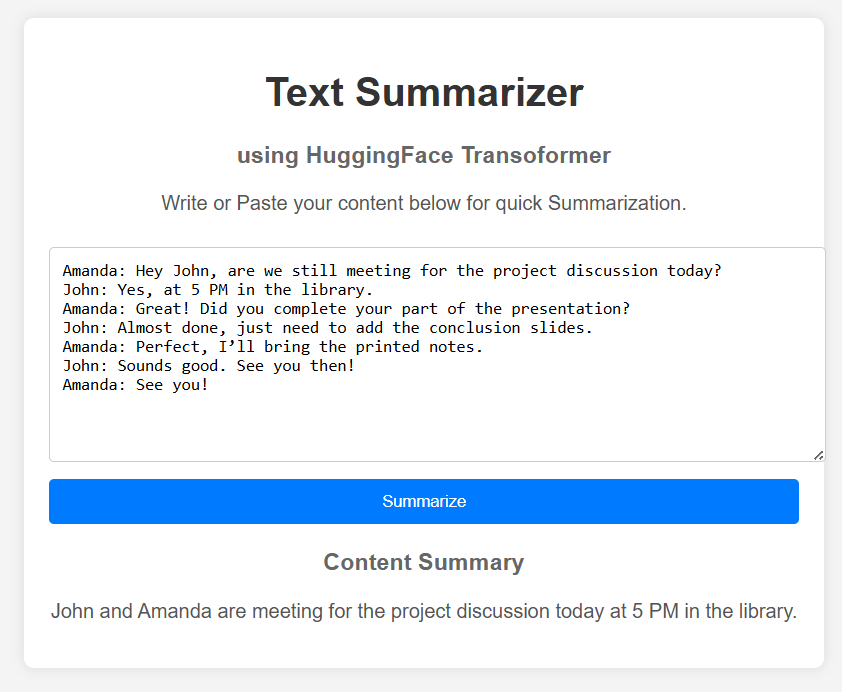

# 🚀 Text Summarizer Web App (T5 + FastAPI)

A full-stack AI-powered web application that summarizes dialogue text using a fine-tuned T5 Transformer model.

---

## 🎯 Features

* 🧠 Dialogue summarization (SAMSum-style)
* ⚡ FastAPI backend for high performance
* 🌐 Simple web interface (HTML + JS)
* 🤖 Transformer model (T5)
* ☁️ Run on Google Colab

---

## 🛠 Tech Stack

* **Backend:** FastAPI
* **Model:** T5 (Hugging Face Transformers)
* **Frontend:** HTML, CSS, JavaScript
* **Deployment:** Colab + Ngrok

---

## 📸 Screenshots - ✨ Summary Output



---

## ⚙️ How It Works

1. User inputs dialogue text
2. Frontend sends request to `/summarize/`
3. Backend processes using T5 model
4. Summary is returned and displayed

---

## 🚀 Run Locally (Basic)

```bash
pip install -r requirements.txt
uvicorn app:app --reload
```

---

## ☁️ Run on Google Colab

👉 See full guide:
📄 [COLAB_SETUP.md](./COLAB_SETUP.md)

---

## 📡 API Endpoint

### POST `/summarize/`

```json
{
  "dialogue": "Your dialogue text here"
}
```

### Response:

```json
{
  "summary": "Generated summary"
}
```

---

## 🧠 Model Training (Custom Fine-Tuned T5)

This application uses a custome fine-tuneed T5 model, for dialogue summarization.

The complete training pipeline (data preprocessing, fine-tuning, and evaluation) is available in this project:

Training Notebook:
[View Training Code](../test_summarizer.ipynb)


---

## ⚠️ Limitations

* Performance depends on input length
* Colab sessions are temporary
* Requires GPU for faster inference

---

---

## 👨‍💻 Author

Ranjan Kumar
B.Tech CSE | AI & ML Engineer / learner

---

## ⭐ If you like this project

Give it a ⭐ on GitHub!
